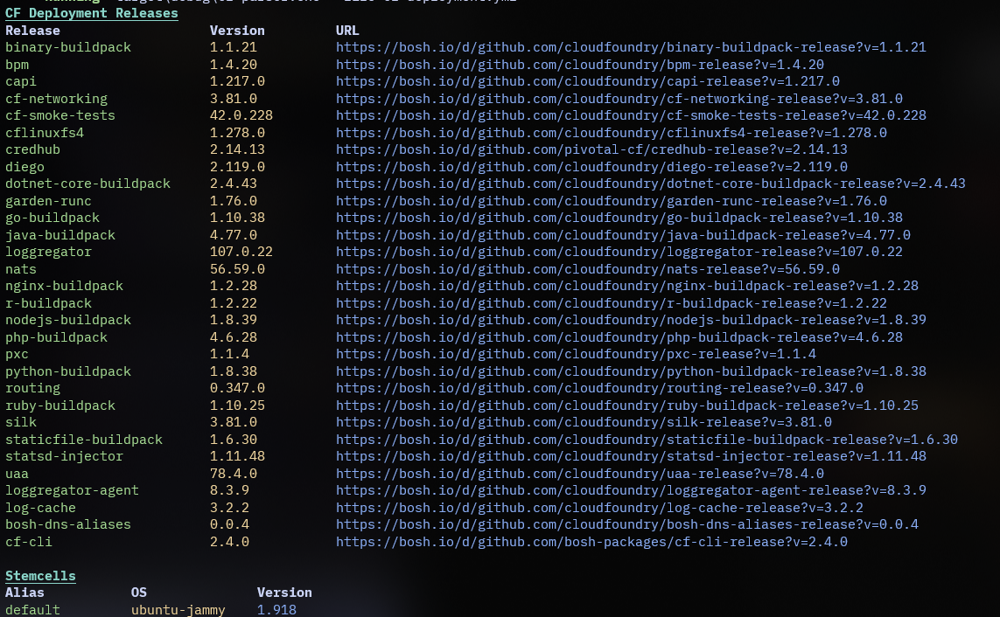

# cf-parser

A Rust-based tool for parsing and processing CloudFormation templates and related infrastructure-as-code files.

## Features

- Fast and efficient parsing of CloudFormation YAML/JSON files
- Extensible architecture for custom processing
- Cross-platform builds (Linux, macOS, Windows)
- Easy integration into CI/CD pipelines

## Getting Started

1. **Clone the repository:**
   ```sh
   git clone https://github.com/yourusername/cf-parser.git
   cd cf-parser
   ```

2. **Build the project:**
   ```sh
   cargo build --release
   ```

3. **Run the parser:**
   ```sh
   ./target/release/cf-parser <path-to-template>
   ```

## Example

You can use `cf-parser` to analyze your CloudFormation templates and output useful information or perform custom checks.

## Sample Output

Below is a sample output visualization generated by `cf-parser`:



## Contributing

Contributions are welcome! Please open issues or submit pull requests for new features, bug fixes, or improvements.

## License

This project is licensed under the MIT License. See [LICENSE](LICENSE) for details.